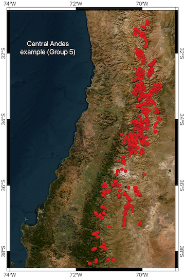

# Glacier-wide Mass Balance Model from Fernández et al (2024), NPJ Climate and Atmospheric Sciences

## Overview

This Julia code implements a model to simulate the mass balance of glaciers over time based on various climate scenarios. The model utilizes temperature, precipitation, and solar radiation data to estimate glacier accumulation and ablation processes.

## Features

- **Inputs:** The model reads climate data from NetCDF files and solar constant data from CSV files. It supports multiple climate models and scenarios.
- **Outputs:** The simulation outputs glacier mass balance, accumulation, ablation, and incoming radiation, saving results in CSV format for further analysis.

## Requirements

Before running the model, ensure you have the following Julia packages installed:

- **ArchGDAL**: For handling geographic data.
- **GeoData**: For managing geospatial data structures.
- **GeoArrays**: For working with geospatial arrays.
- **NCDatasets**: For reading NetCDF files.
- **CSV**: For reading and writing CSV files.
- **DataFrames**: For data manipulation and storage.
- **Dates**: For handling date and time operations.
- **StatsBase**: For statistical functions.

You can install the required packages using Julia's package manager. Run the following commands in the Julia REPL:

```julia
using Pkg
Pkg.add("ArchGDAL")
Pkg.add("GeoData")
Pkg.add("GeoArrays")
Pkg.add("NCDatasets")
Pkg.add("CSV")
Pkg.add("DataFrames")
Pkg.add("Dates")
Pkg.add("StatsBase")
```
Or you can install the Julia project and then dependencies

```julia
julia --project=.
julia --project=. -e 'using Pkg; Pkg.instantiate()'
```

## Usage

Set up the directory structure: Ensure you have the following directories with the required data files:

- *Data_in/Solar_Constant/*
- *Data_in/Climate_data_input/*
- *Data_in/Topo_data/*
- *Data_in/Hypsometry/*
- *Data_in/Coordinates/*
- *Data_in/Optimized_Parameters/*

The example data provides the internal directory structure (see below)

## Run the model

Execute the script in Julia. You can use the following command in the terminal:

```julia
julia --project=. GMBM.jl
```

## Review outputs

The results for each glacier zone and experiment will be saved as CSV files in the *Data_out/* directory

## Code Structure
- **GMBM.jl**: This is the main loop that iterates over climate models and experiments, extracting data and performing calculations for each glacier.
- **Functions**: The code includes several functions to handle different parts of the simulation, such as calculating incoming radiation and albedo:
	- **dem_pixel.jl**: function to get the ERA pixel elevation for each glacier.
	- **albedo.jl**: function to calculate albedo according to hypsometry.
	- **in_radiation.jl**: function to calculate incoming solar radiation

## Example Data

The model is configured to run the Central Andes region (CA, see paper) as an example



The data can be downloaded in the following link
